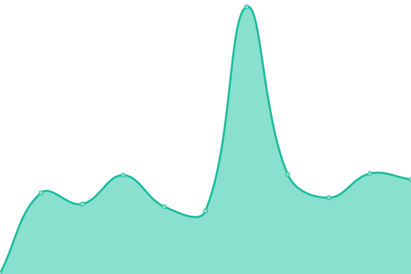

# [📈 Live Status](https://status.toomanyfiles.dev): <!--live status--> **🟩 All systems operational**

This repository contains the open-source uptime monitor and status page for [Upptime](https://upptime.js.org), powered by [Upptime](https://github.com/upptime/upptime).

With [Upptime](https://upptime.js.org), you can get your own unlimited and free uptime monitor and status page, powered entirely by a GitHub repository. We use [Issues](https://github.com/upptime/upptime/issues) as incident reports, [Actions](https://github.com/TooManyFiles/upptime/actions) as uptime monitors, and [Pages](https://status.toomanyfiles.dev) for the status page.

<!--start: status pages-->
<!-- This summary is generated by Upptime (https://github.com/upptime/upptime) -->
<!-- Do not edit this manually, your changes will be overwritten -->
<!-- prettier-ignore -->
| URL | Status | History | Response Time | Uptime |
| --- | ------ | ------- | ------------- | ------ |
|  [Main Page - TooManyFiles](https://toomanyfiles.dev/) | 🟩 Up | [main-page-too-many-files.yml](https://github.com/TooManyFiles/upptime/commits/HEAD/history/main-page-too-many-files.yml) | 

 755ms
     
 | 

<a href="https://status.toomanyfiles.dev/history/main-page-too-many-files">100.00%</a>
    

|  [WAKApi - TooManyFiles](https://waka.toomanyfiles.dev/) | 🟩 Up | [wak-api-too-many-files.yml](https://github.com/TooManyFiles/upptime/commits/HEAD/history/wak-api-too-many-files.yml) | 

 528ms
     
 | 

<a href="https://status.toomanyfiles.dev/history/wak-api-too-many-files">100.00%</a>
    

|  [Coder - TooManyFiles](https://coder.toomanyfiles.dev/) | 🟩 Up | [coder-too-many-files.yml](https://github.com/TooManyFiles/upptime/commits/HEAD/history/coder-too-many-files.yml) | 

 470ms
     
 | 

<a href="https://status.toomanyfiles.dev/history/coder-too-many-files">100.00%</a>
    

|  [Matrix - TooManyFiles](https://matrix.toomanyfiles.dev/) | 🟩 Up | [matrix-too-many-files.yml](https://github.com/TooManyFiles/upptime/commits/HEAD/history/matrix-too-many-files.yml) | 

 787ms
     
 | 

<a href="https://status.toomanyfiles.dev/history/matrix-too-many-files">100.00%</a>
    

|  [AboutMePage - Mr-Comand](https://mr-comand.toomanyfiles.dev/) | 🟩 Up | [about-me-page-mr-comand.yml](https://github.com/TooManyFiles/upptime/commits/HEAD/history/about-me-page-mr-comand.yml) | 

 540ms
     
 | 

<a href="https://status.toomanyfiles.dev/history/about-me-page-mr-comand">100.00%</a>
    

|  [YourSpotify(Stats) - TooManyFiles](https://spstat.toomanyfiles.dev/) | 🟩 Up | [your-spotify-stats-too-many-files.yml](https://github.com/TooManyFiles/upptime/commits/HEAD/history/your-spotify-stats-too-many-files.yml) | 

 435ms
     
 | 

<a href="https://status.toomanyfiles.dev/history/your-spotify-stats-too-many-files">100.00%</a>
    

|  [YourSpotify(Stats)-API - TooManyFiles](https://spstat.api.toomanyfiles.dev/) | 🟩 Up | [your-spotify-stats-api-too-many-files.yml](https://github.com/TooManyFiles/upptime/commits/HEAD/history/your-spotify-stats-api-too-many-files.yml) | 

 424ms
     
 | 

<a href="https://status.toomanyfiles.dev/history/your-spotify-stats-api-too-many-files">100.00%</a>
    

|  Timetable | 🟩 Up | [timetable.yml](https://github.com/TooManyFiles/upptime/commits/HEAD/history/timetable.yml) | 

 640ms
     
 | 

<a href="https://status.toomanyfiles.dev/history/timetable">100.00%</a>
    

<!--end: status pages-->

[**Visit our status website →**](https://status.toomanyfiles.dev)

## 📄 License

- Powered by: [Upptime](https://github.com/upptime/upptime)
- Code: [MIT](./LICENSE) © [Anand Chowdhary](https://anandchowdhary.com), supported by [Pabio](https://pabio.com)
- Data in the `./history` directory: [Open Database License](https://opendatacommons.org/licenses/odbl/1-0/)
